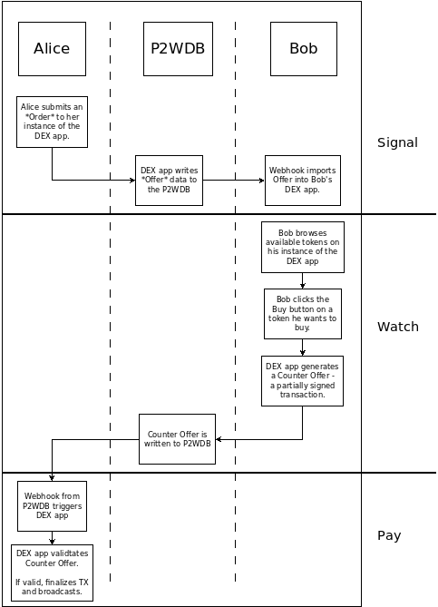

# Introduction

The [Permissionless Software Foundation](https://psfoundation.cash) maintains DEXs on the Bitcoin Cash (BCH) and eCash (XEC) blockchains. They've built a prototype on the Avalanche X-Chain (AVAX), but it requires additional development.

These DEXs let's *individuals* trade tokens in a peer-to-peer fashion. These DEXs have the following properties:

- **peer-to-peer** - trades take place between two individuals. There is no company or other intermediary between the two.
- **trustless** - Neither individual needs to know or trust the other person. There is no way one person can gain an advantage over the other during the trade.
- **atomic** - There are only two states to a trade. Each person either has their original coins, or the token they are trying to exchange. There is no way the trade can be in a state where funds get stuck.

To get started **Buying** tokens, check out the instructions for using the [Buyer Wallet](#).

To get started **Selling** tokens, checkout out the documentation for setting up a [Seller Wallet](#).

The DEX operates as an extension of the Bitcoin protocol. That means there is no '.com' website that can be blocked, no account that can shut down, and no government ID required to use it. It's a peer-to-peer protocol, just like Bitcoin. When you trade, there are only two parties. There is no intermediary. And no one can stop you from running the software in the comfort of your own home.

<iframe width="731" height="411" src="https://www.youtube.com/embed/LVX8CLi4sHw" title="YouTube video player" frameborder="0" allow="accelerometer; autoplay; clipboard-write; encrypted-media; gyroscope; picture-in-picture" allowfullscreen></iframe>

## SWaP Protocol

The protocol used to trade tokens is based on Vin Armani's [SWaP Protocol](https://github.com/vinarmani/swap-protocol). Here is a flow-chart diagram of how two people, Alice and Bob, conduct a trade.

There are three phases to the trade:

- Signal
- Watch
- Pay

The [Pay To Write Database (P2WDB)](https://p2wdb.com) is used to store trade data while Alice and Bob negotiate the trade. But any database, even the blockchain itself, can be used to store this data.

### Signal
In the first phase, Alice has a token that she wants to sell on the open market. Using the [Seller Wallet](#), she selects the token, the quantity to sell, and at what price. This generates an *Order*, which is tracked by her DEX software. The app also writes the trade data to the pay-to-write database (P2WDB) as an *Offer*. Alice is known as a Maker, because she just *made* an Offer.

### Watch
Bob wants to buy tokens, so he uses the [Buyer Wallet](#) to browse tokens for sale on the open market. He sees Alice's listing and clicks the Buy button. His instance of the DEX generates a Counter Offer. This is a partially-signed transaction based on data in the Offer. The Counter Offer is uploaded to the P2WDB.

Bob is known as a Taker, because he just *took* the Offer by generating a Counter Offer.

### Pay
Alice's [Seller Wallet](#) is monitoring the P2WDB for Counter Offers. It detects Bob's Counter Offer and validates it, ensuring that the transaction meets the terms she set in the Offer. Because of the rules in the Bitcoin transaction, Alice is not able to manipulate Bob's inputs or outputs. She can only accept or reject the Counter Offer. If the Counter Offer passes validation, her instance of the DEX signs her token input and broadcasts the transaction to the network.

The trade is then complete. Alice has the coins and Bob has the tokens. Both parties got what the wanted, and neither party has the opportunity to take advantage of the other (trustless). The trade completes in a single on-chain transaction (atomic), transferring the tokens and coins instantly and at the same time, with no need for escrow or intermediaries.
