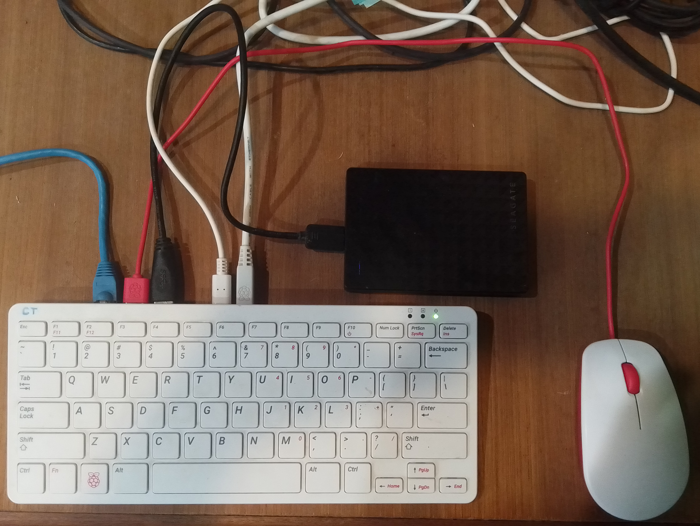

# Raspberry Pi Setup

Before installing the software, you must setup your hardware device. The target operating to run the `bch-dex` software is Ubuntu Linux. An SD card of 64GB or bigger is recommended. Using a USB 3.0 hard drive is even better than an SD card, but this requires a firmware update to the Raspberry Pi.

## Videos:

- [Install other operating systems on the Raspberry Pi](https://youtu.be/lbAPR4rRiVI)
- [Installing pi-clone](https://youtu.be/9-UrlsS2uwE) to 'save your game'
- [Setup Remote Desktop screen sharing](https://youtu.be/cUu59ceXtWE)
- [Install Docker and other software](https://youtu.be/w5mpwX4vUIg) based on [these instructions](https://gist.github.com/christroutner/a39f656850dc022b60f25c9663dd1cdd)

## Booting from a Hard Drive

A Raspberry Pi runs best from a USB 3.0 hard drive, than an SD card. This allows the device to have additional swap space memory, cheaper storage, and is less likely to suffer from corruption than an SD card. [This article](https://www.tomshardware.com/how-to/boot-raspberry-pi-4-usb) shows step-by-step instructions for installing the firmware update that allows the Raspberry Pi to boot from a USB hard drive. It also shows how to use pi-clone (see the video link above), to flash the hard drive with Ubuntu Linux using the Raspberry Pi Imager.

