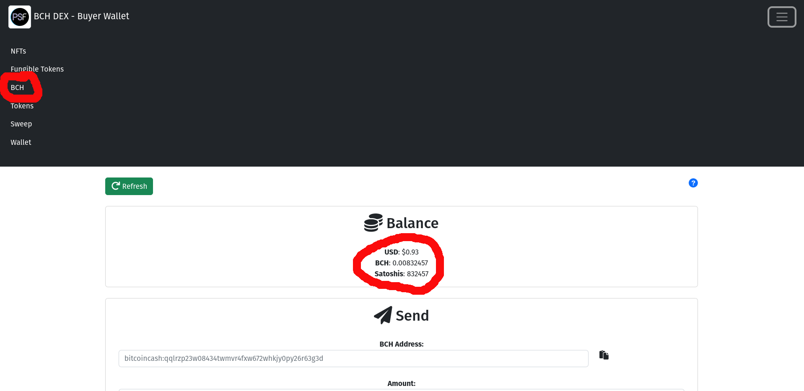
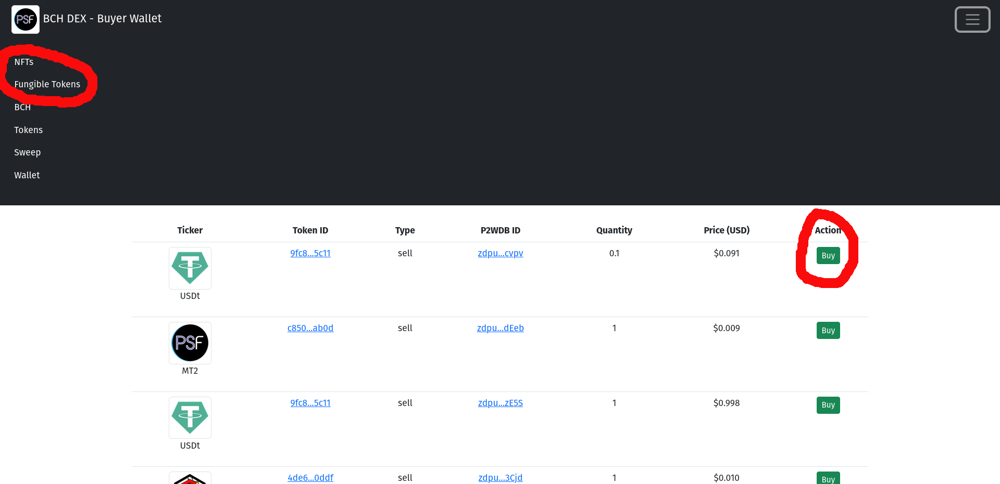
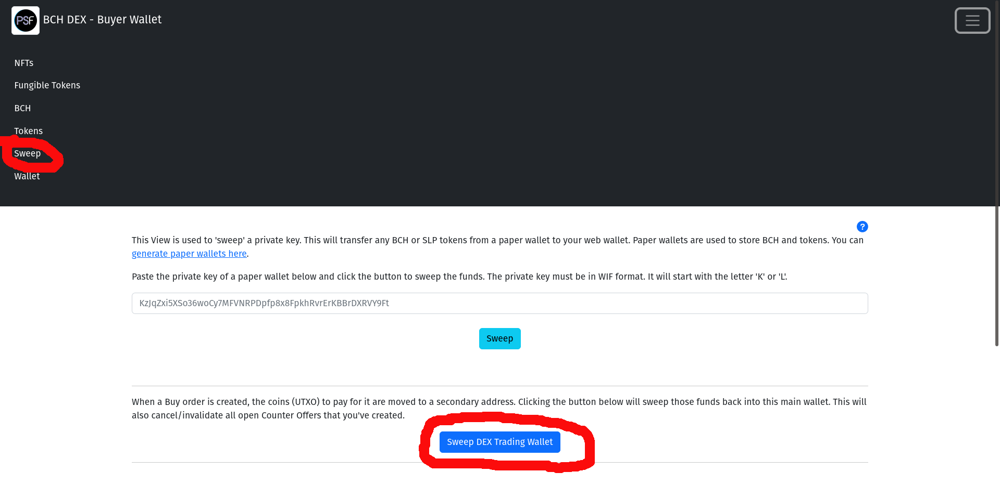

# Buyer Wallet

Buying tokens requires no special setup. It's much easier than selling tokens.

- [DEX Buyer Wallet App](https://dex.psfoundation.info)

The [source code](https://github.com/Permissionless-Software-Foundation/bch-dex-taker-v2) for the app above is available on Github. Anyone can run their own copy of the DEX Buyer Wallet App.

## Back Up Your Wallet
The first time you load the Buyer Wallet app in your browser, it will generate a wallet for you. It's very important that you back up your wallet, by writing down your 12 word mnemonic, in case you ever need to recover your funds. Do not rely on the web browser to save your wallet information.

<iframe width="731" height="411" src="https://www.youtube.com/embed/0R00cppN0fA" title="YouTube video player" frameborder="0" allow="accelerometer; autoplay; clipboard-write; encrypted-media; gyroscope; picture-in-picture" allowfullscreen></iframe>

## Fund Your Wallet
In order to purchase tokens, you will need to fund your wallet with Bitcoin Cash (BCH). You can purchase Bitcoin Cash through [Paypal](https://paypal.com) or trade another cryptocurrency for it using [Asgardex](https://github.com/asgardex/asgardex-desktop) (which uses Thorchain.) 

## Browse & Buy Tokens
Browse the market of tokens. There are two separate views: One for NFTs, and one for fungible tokens. Once you find a token you want to purchase, click the 'Buy' button. This will generate and broadcast a Counter Offer. It can take a few minutes.

Once your web browser has generated a Counter Offer, the Buyer side of the trade has been completed. If the Seller's software is online, it will detect your Counter Offer and finalize the transaction within a few minutes. The tokens will appear in the *Tokens* section of your wallet once the sale transaction completes.

## Recovering Funds

Whenever a *Counter Offer* is generated, the funds are moved to a [child address of the wallet](https://github.com/bitcoinbook/bitcoinbook/blob/develop/ch05.asciidoc#hd-wallets-bip-32bip-44), to protect the UTXO until the sale has been completed. If the token you tried to purchase never appears in your wallet, you can recover those funds and *sweep* them back into the primary address of your wallet. This is done by navigating to the Sweep view, and clicking the 'Sweep DEX Trading Wallet'. This will automatically cancel the Counter Offer you generated previously.

