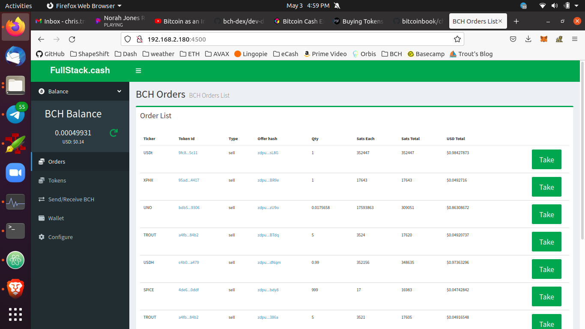

# Buying Tokens

Tokens will only appear in the `Orders` tab of the web wallet if both of these conditions are met:
- The 12 word mnemonic has been imported into the wallet, as described in [Prepare the Web Wallet](/usage/prepare-wallet).
- The P2WDB has had enough time (about an hour) to sync.

If both of those conditions are met, your web wallet should appear like the screen shot below, listing different tokens for sale in the `Orders` tab.

Each line will list a token quantity and lot price. In the current version, tokens are purchased in *lots*. For instance, if 5 tokens are for sale, you must buy all 5. You can't buy 3 of the 5. Purchase a *lot* by clicking on the `Take` button to the right of that listing.

If successful, your instance of `bch-dex` will issue a [Counter Offer](https://github.com/Permissionless-Software-Foundation/bch-dex/tree/09cbfd00e86511e4161cfa653d664ffa98b1d36f/dev-docs#definitions) to purchase the tokens. The tokens will appear in your web wallet once the seller has Accepted the trade. If the sellers `bch-dex` is live on the network, it should Accept the trade by broadcasting the transaction within a few minutes.

As part of generating the Counter Offer, your wallet will move the payment BCH to a new address controlled by the 12-word mnemonic of your wallet. Even though they do not appear in the web wallet, the funds have not left your wallet. They have simply been moved to a [child address of the HD wallet](https://github.com/bitcoinbook/bitcoinbook/blob/develop/ch05.asciidoc#hd-wallets-bip-32bip-44), and you still retain full control of the funds. The seller can not take your funds unless they give you the tokens.

