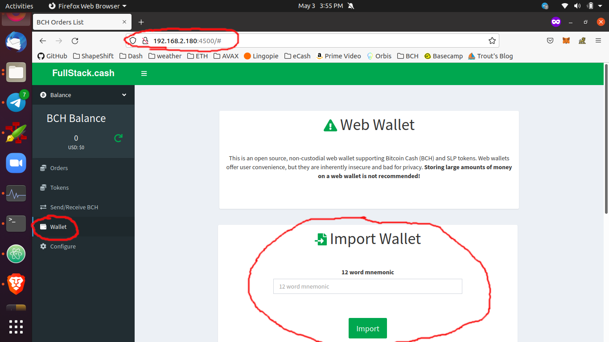

# Prepare the Web Wallet

In order to buy or sell tokens, your wallet will need two things:
- BCH to pay transaction fees
- PSF to pay for storage of transaction data

Trade communication takes place both on and off the blockchain. Your wallet will need Bitcoin Cash (BCH) to pay the on-chain transaction fees. Trade data is stored on the [Pay-to-Write Database](https://github.com/Permissionless-Software-Foundation/ipfs-p2wdb-service) (P2WDB). In order to write data to the database, payments are made by burning small amounts of PSF tokens. You can purchase PSF tokens at [PSFoundation.cash](https://psfoundation.cash) by sending a few cents of BCH to the PSF token-liquidity app.

## Import Your Wallet

Bring up the user interface by opening a web browser and navigating to port 4500 of the device running `bch-dex`. For example, if your device had an internal IP address of `192.168.2.180`, then you would navigate your web browser to `http://192.168.2.180:4500`.

During setup, it was necessary to create a new wallet, which created the `production/scripts/wallet.json` file. Inside that file will be 12 words associated with the property `mnemonic`.

Within the web wallet, navigate to the `Wallet` tab. Copy and paste the 12 word mnemonic into the `Import Wallet` Card. Then click the `Import` button. This will mirror the same wallet in the web app that is being used by bch-dex.

Now you can send BCH to your web wallet, and it will also be usable by `bch-dex`. You can then send some BCH from the web wallet to the PSF token-liquidity app to purchase some PSF tokens.

