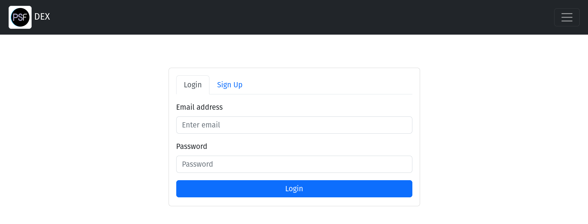
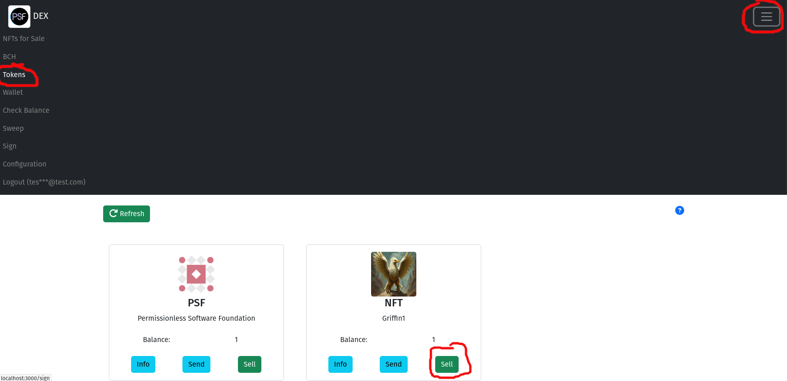
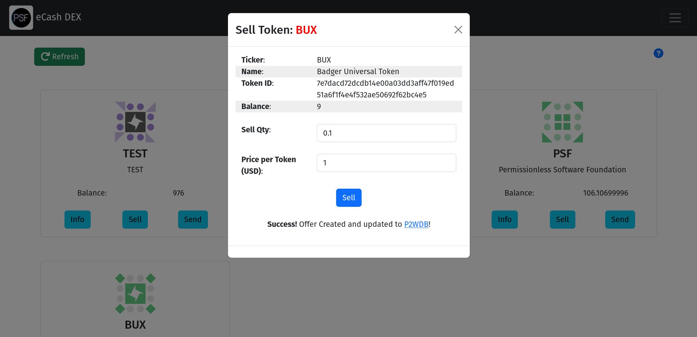

# Seller Wallet

There are two actors required for selling tokens:
- *Servers* are a running instance of the [Server software](/usage/server). One Server can support many Sellers.
- *Sellers* are users of the Server. They have a joint-custody 12-word mnemonic the Seller shares with the Server.

[Running a Server](/usage/server) requires a significant level of setup. Currently it requires a computer running Ubuntu Linux. A Server can support a single Seller, or many Sellers. A Seller's software must be online in order to respond to Counter Offers from Buyers.

The easiest way to become a Seller of SLP tokens is to find someone running a Server and ask for permission to create an account. If you don't know anyone running a Server, you'll need to follow the instructions to [setup your own Server](/usage/server).

The following instruction assume that you have an account on a Server.

<iframe width="639" height="359" src="https://www.youtube.com/embed/0ewHPlb57KM" title="Selling NFTs (simple)" frameborder="0" allow="accelerometer; autoplay; clipboard-write; encrypted-media; gyroscope; picture-in-picture; web-share; fullscreen" allowfullscreen></iframe>


## Selling Tokens

Log into the Server using your email and password.



Once logged in, tokens can be sold by navigating to the 'Tokens' (BCH) view of the web wallet. Any SLP tokens sent to the wallet will appear here. Inside the token card will be a 'Sell' button. Clicking on that button will open the Sell Modal.



The Sell Modal has two text boxes to fill out:

- Sell Qty: This is the quantity of tokens you want to sell.
- Price per Token: This is the price for a *whole* token.

The 'Price per Token' field often trips people up. This is the price of a *whole* token, not the price of the quantity you are selling.

> Example: If you want to **sell $0.10 of BUX token**, you would fill out the following:
> - *Sell Qty* of 0.1
> - *Price Per Token* value of 1.

After filling out the form, click the Sell button. The DEX will generate the token UTXO and list it for sale on the DEX.



## Recovering Funds

**TODO: This section need to be developed and updated. Text below is for an older version of bch-dex.**

Whenever an *Offer* or a *Counter Offer* is generated, the funds are moved to a [child address of the HD wallet](https://github.com/bitcoinbook/bitcoinbook/blob/develop/ch05.asciidoc#hd-wallets-bip-32bip-44), to protect the UTXO until the sale has been completed. You can recover those funds and *sweep* them into the root address used by the web wallet by running the [`sweep-wallet.js` script](https://github.com/Permissionless-Software-Foundation/bch-dex/blob/master/production/scripts/sweep-wallet.js) in the `production/scripts` directory:

- `node sweep-wallet.js`

**Warning**: This will destroy all Offers and Counter Offers on the DEX associated with your wallet.

You should see an output similar to this:

```
Sweeping all funds into root address bitcoincash:qr2xgcdldf0n4rswp6fts4r944ukjmxtwc5e8yyxds...

Sweeping bitcoincash:qzq5yzrjwtmvflx0v5kslp8k8462fcm5fyzc4wv347
Not enough BCH found on paper wallet. Sweeping with BCH from the reciever wallet.
Swept HD index 1. TXID: c49ad480e18597139b05841f032a64721e33e5e63d493a8b4daca60edab74588

```
