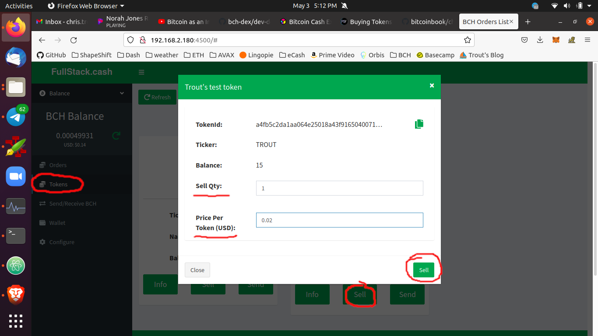

# Selling Tokens

To sell tokens, start by sending an SLP (fungible) token or NFT to the web wallet address. The tokens will appear in the `Tokens` tab. Each token *class* will be represented by a *Card*. The Card will display the balance of tokens controlled by your wallet, and within the Card is a `Sell` button.

When the `Sell` button is clicked in the Card, it will open a *Sell Modal*. In this modal, type the quantity of tokens you wish to sell, and the *price per token* that you'd like to sell them out.

If you have created a new token and don't know what price to sell it at, try the suggested defaults:
- 1 token
- at $0.02 USD per token

Click the `Sell` button in the modal, and the web app will attempt to post an [Offer](https://github.com/Permissionless-Software-Foundation/bch-dex/tree/09cbfd00e86511e4161cfa653d664ffa98b1d36f/dev-docs#definitions) to the network.

As part of generating the Offer, your wallet will move the tokens to a new address controlled by the 12-word mnemonic of your wallet. Even though they do not appear in the web wallet, the tokens have not left your wallet. They have simply been moved to a [child address of the HD wallet](https://github.com/bitcoinbook/bitcoinbook/blob/develop/ch05.asciidoc#hd-wallets-bip-32bip-44), and you still retain full control of the tokens. The buyer can not take your tokens until their instance of `bch-dex` sends a partially-signed transaction to pay for them, and your `bch-dex` instance verifies the sale conditions and then broadcasts the transaction.

